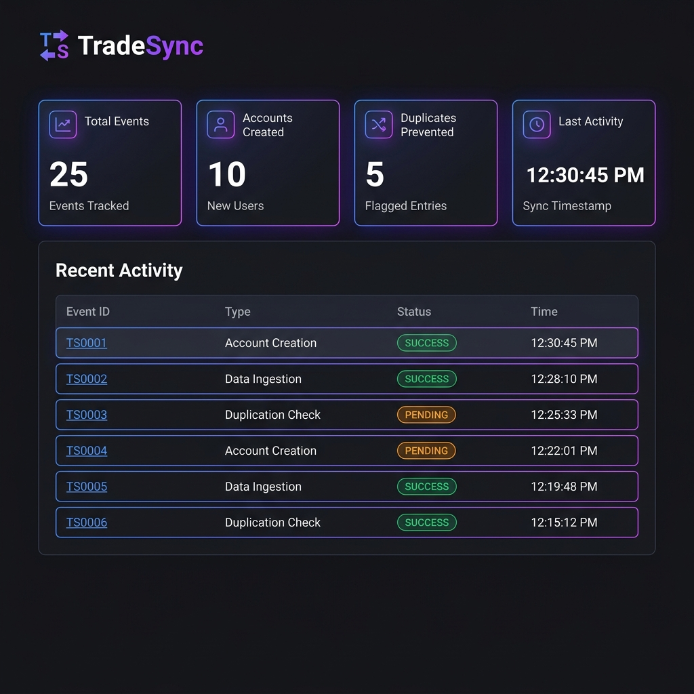
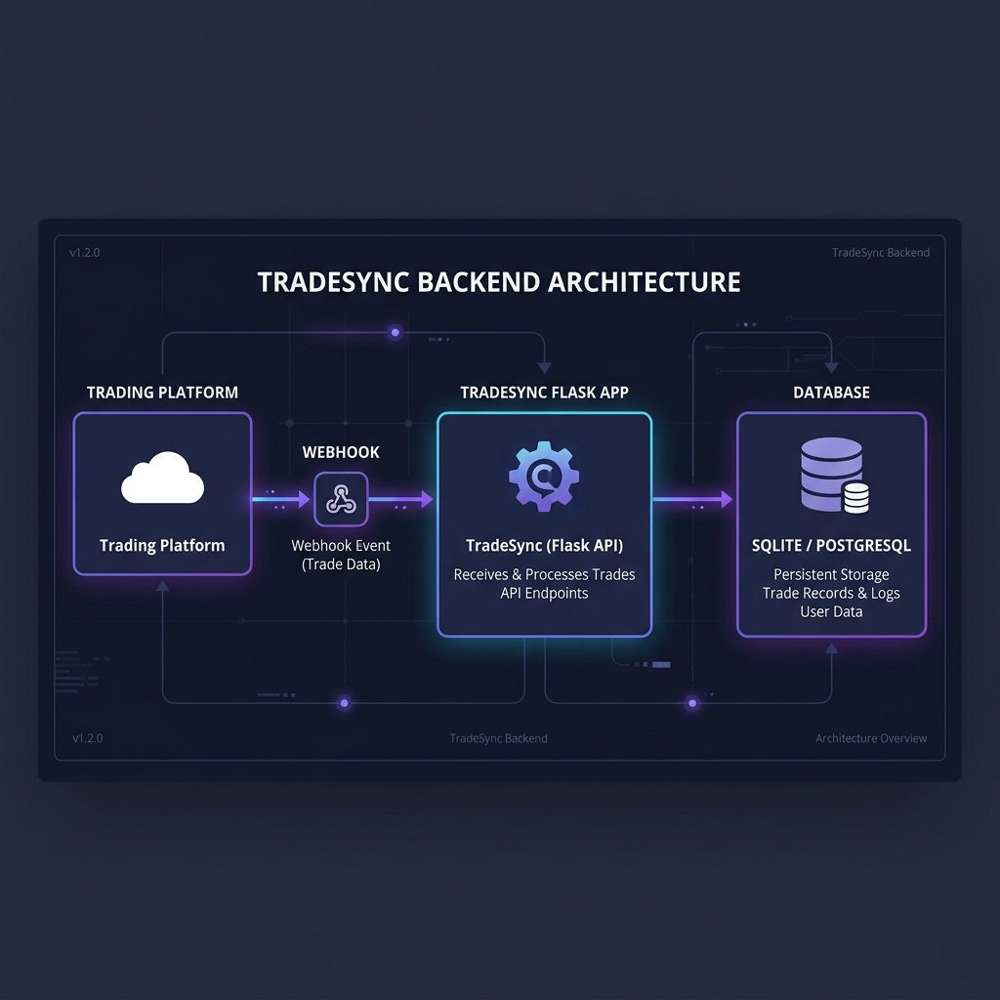
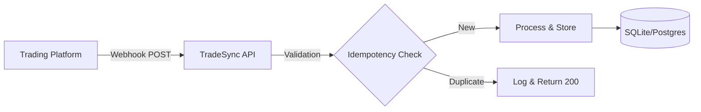

# TradeSync 🔄

**TradeSync** is a professional fintech webhook processing service built with **Python**, **Flask**, and **SQLite**. It is designed to receive, process, and audit trading account events with high reliability and idempotent processing.



## 🚀 Key Features

- **Webhook Processing**: Dedicated endpoint `POST /webhook` to handle asynchronous trading events.
- **Idempotency**: Robust duplicate detection using `event_id` to ensure data integrity.
- **Visual Dashboard**: A sleek, modern monitoring interface with live metrics and activity tracking.
- **Audit Trail**: Full history of received webhooks for debugging and compliance.
- **Extensible Event Model**: Easily add support for payouts, balance updates, and account status changes.
- **Developer Metrics**: Real-time tracking of processed events, created accounts, and prevented duplicates.

## 🏗️ Architecture

TradeSync follows a clean, decoupled architecture suitable for high-frequency trading environments.





### Webhook Flow
1. **Reception**: Payload is received and validated for required fields.
2. **Idempotency**: The system checks if the `event_id` exists in the database.
3. **Persistence**: The raw event is stored for auditing.
4. **Processing**: Event-specific logic (e.g., creating a new trading account) is executed.
5. **Monitoring**: Metrics are updated in real-time on the dashboard.

## 📡 API Documentation

Visit **`/docs`** on the running server for full interactive documentation.

| Endpoint | Method | Description |
| :------- | :----- | :---------- |
| `/` | `GET` | **Dashboard**: Live monitoring and demo control center. |
| `/docs` | `GET` | **API Reference**: Detailed request/response examples. |
| `/health` | `GET` | **Health Status**: System diagnostic check. |
| `/webhook` | `POST` | **Webhook Receiver**: Idempotent event processing. |
| `/api/accounts`| `GET` | **Data Export**: JSON list of all registered accounts. |

## 🛠️ Skills Demonstrated

- **Systems Integration**: Building robust interfaces for external trading platforms.
- **Data Integrity**: Implementing idempotency patterns to prevent data corruption.
- **FinTech Domain**: Handling complex account payloads and transaction signatures.
- **Monitoring & Observability**: Creating live dashboards and health tracking endpoints.
- **Database Design**: Modeling relational schemas for auditability and scale.
- **Professional Documentation**: Creating recruiter-friendly READMEs and API docs.

## ⚙️ Setup & Installation

### Prerequisites
- Python 3.8+

### Quick Start
1. **Clone & Install**:
   ```bash
   pip install -r requirements.txt
   ```
2. **Run the App**:
   ```bash
   python run.py
   ```
3. **Explore**: Open `http://localhost:5000` to see the dashboard.

## 📝 Resume Summary

**TradeSync | Backend Engineering Project**
- Developed a fintech-ready webhook service using Flask and SQLAlchemy to handle high-frequency trading account events.
- Engineered a custom idempotency layer to ensure exactly-once processing of critical financial data.
- Designed a real-time monitoring dashboard with live metrics, audit logs, and diagnostic endpoints.
- Built a portable development environment using SQLite with seamless PostgreSQL compatibility for production scaling.

---
Built for reliability. Ready for production. 🚀
